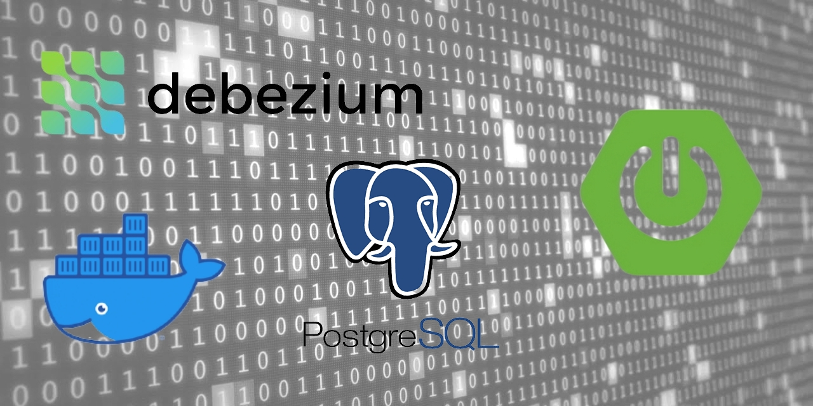

# Spring Boot + Debezium + PostgreSQL


## INTRODUCTION
Debezium is a distributed platform used to implement Change Data Capture (a.k.a CDC) from SQL and NoSQL databases into event streams, enabling applications to detect and immediately respond to row-level changes in the databases. Debezium is built on top of Apache Kafka and provides a set of Kafka Connect compatible connectors. Each of the connectors works with a specific database.

<br>

## OVERVIEW
In this project, I implement the Debezium service programmatically, and run via Docker a PostgreSQL database server with an example table in order to monitor all events about data insertion or change.

<br>

## PREREQUISITES
- Java
- Docker

<br>

## HOW TO TEST
1. Spin up a Docker PostgreSQL instance by setting the only required property to enable the database usage by Debezium, i.e. `wal_level = logical`:
```shell
$ docker run --name postgres -e POSTGRES_PASSWORD=postgres -p 5432:5432 --rm -it postgres:11-alpine3.16 -c wal_level=logical
```
### DESCRIPTIONS OF MYSQL BINLOG CONFIGURATION PROPERTIES
| Property  | Description |
| :-------- | :---------- |
| wal_level | Determines how much information is written to the Write-Ahead Log |

For more information visit this [link](https://postgresqlco.nf/doc/en/param/wal_level/?category=write-ahead-log).

2. Connect to PostgreSQL docker instance:
```shell
docker exec -it postgres bash
```

3. Once inside, create the database and table to run the demo application:
```shell
createdb -h localhost -p 5432 -U postgres customerdb;
```
```shell
CREATE TABLE customer ( id SERIAL PRIMARY KEY, email VARCHAR(255), fullname VARCHAR(255) );
```

4. From another terminal, run the application:
```shell
./mvnw spring-boot:run
```

5. Back to the Docker terminal, insert some data into the `customerdb` table:
```shell
INSERT INTO customer (email, fullname) VALUES ('john.doe@acme.com', 'John Doe');
```

6. From the application's console, you should see a data insertion event log similar to the one below:
```log
2022-09-19 15:21:53.172  INFO 657338 --- [pool-1-thread-1] i.d.connector.common.BaseSourceTask      : 1 records sent during previous 00:00:27.822, last recorded offset: {transaction_id=null, lsn_proc=23627000, lsn=23627000, txId=598, ts_usec=1663611712485733}
2022-09-19 15:21:53.180  INFO 657338 --- [pool-1-thread-1] i.d.listener.DebeziumListener            : Key = Struct{id=9}, Value = Struct{after=Struct{email=john.doe@acme.com,fullname=John Doe},source=Struct{version=1.9.4.Final,connector=postgresql,name=customer-postgres-db-server,ts_ms=1663611712485,db=customerdb,sequence=[null,"23627000"],schema=public,table=customer,txId=598,lsn=23627000},op=c,ts_ms=1663611712770}
2022-09-19 15:21:53.180  INFO 657338 --- [pool-1-thread-1] i.d.listener.DebeziumListener            : SourceRecordChangeValue = 'Struct{after=Struct{email=john.doe@acme.com,fullname=John Doe},source=Struct{version=1.9.4.Final,connector=postgresql,name=customer-postgres-db-server,ts_ms=1663611712485,db=customerdb,sequence=[null,"23627000"],schema=public,table=customer,txId=598,lsn=23627000},op=c,ts_ms=1663611712770}'
```
